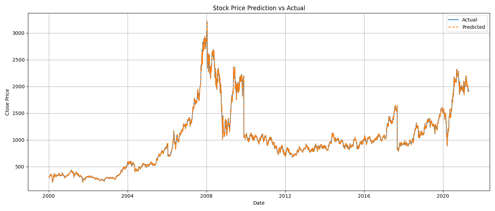

<h1>📈 StockWise - Advanced Time Series Modeling</h1>

This project demonstrates a comprehensive approach to time series forecasting using historical stock price data.
Leveraging Python and machine learning, we build and evaluate a predictive model for next-day stock closing prices using
features such as <strong>Open</strong>, <strong>High</strong>, <strong>Low</strong>, <strong>Close</strong>, and <strong>Volume</strong>.
The project includes data preprocessing, visualization, modeling, evaluation, and export functionalities.

<h2>📌 Project Highlights</h2>
<ul>
  <li>Built with <strong>Python 3</strong> and <strong>Scikit-learn</strong></li>
  <li>Time-series-aware modeling using <code>TimeSeriesSplit</code></li>
  <li>Includes <strong>data cleaning, feature engineering, multi-day forecasting</strong></li>
  <li>Model evaluation using <strong>R² score</strong> and <strong>Mean Squared Error</strong></li>
  <li>Visual comparison of actual vs predicted stock prices</li>
  <li>Auto-saving model and results in <code>/outputs</code> directory</li>
</ul>

<h2>📂 Project Structure</h2>

<table border="1" cellpadding="6" cellspacing="0">
  <tr>
    <th>File/Folder</th>
    <th>Description</th>
  </tr>
  <tr>
    <td><code>Data/RELIANCE.csv</code></td>
    <td>Historical stock data for Reliance Industries</td>
  </tr>
  <tr>
    <td><code>stockwise.py</code></td>
    <td>Main Python script for preprocessing, training, evaluation, and saving model</td>
  </tr>
  <tr>
    <td><code>outputs/</code></td>
    <td>Folder containing generated plots, predictions, and saved model</td>
  </tr>
  <tr>
    <td><code>README.md</code></td>
    <td>This README file</td>
  </tr>
</table>

<h2>⚙️ Installation & Setup</h2>

<ol>
  <li>Clone the repository:
    <pre><code>git clone https://github.com/muneeb-shafique/StockWise</code></pre>
  </li>
  <li>Navigate into the project directory:
    <pre><code>cd stockwise</code></pre>
  </li>
  <li>Create and activate a virtual environment (optional but recommended):
    <pre><code>python -m venv venv
source venv/bin/activate  # On Linux/Mac
venv\Scripts\activate.bat  # On Windows</code></pre>
  </li>
</ol>

<blockquote>
  <strong>Note:</strong> Make sure the <code>Data</code> folder exists with a file named <code>RELIANCE.csv</code> in it.
</blockquote>

<h2>🧪 How It Works</h2>

<h3>1. Data Loading</h3>

Loads and cleans the CSV data, retaining only the necessary columns and converting date formats.

<h3>2. Feature Engineering</h3>

Creates lag features and rolling averages for future multi-day price predictions.

<h3>3. Model Training</h3>

Uses <code>LinearRegression</code> with <code>TimeSeriesSplit</code> to respect the temporal nature of the data.

<h3>4. Evaluation</h3>

Calculates Mean Squared Error (MSE) and R² Score, and generates prediction plots for visual inspection.

<h3>5. Outputs</h3>
<ul>
  <li><code>outputs/predictions.csv</code> - CSV with actual vs predicted prices</li>
  <li><code>outputs/full_predictions_plot.png</code> - Line plot comparing actual and predicted prices</li>
  <li><code>outputs/stock_model.pkl</code> - Saved trained model</li>
</ul>

<h2>📊 Example Visualization</h2>

The model produces a side-by-side comparison between the predicted and actual closing prices over time.

<h2>📦 Requirements</h2>

<table border="1" cellpadding="6" cellspacing="0">
  <tr>
    <th>Library</th>
    <th>Purpose</th>
  </tr>
  <tr>
    <td><code>pandas</code></td>
    <td>Data loading and manipulation</td>
  </tr>
  <tr>
    <td><code>numpy</code></td>
    <td>Numerical calculations</td>
  </tr>
  <tr>
    <td><code>matplotlib</code></td>
    <td>Plotting and visualizations</td>
  </tr>
  <tr>
    <td><code>scikit-learn</code></td>
    <td>Model training and evaluation</td>
  </tr>
  <tr>
    <td><code>joblib</code></td>
    <td>Model saving</td>
  </tr>
</table>

<h2>🛠️ Future Improvements</h2>

<ul>
  <li>Incorporate <strong>LSTM (Long Short-Term Memory)</strong> for sequence-based modeling</li>
  <li>Allow real-time prediction via API</li>
  <li>Add more advanced technical indicators (RSI, MACD, etc.)</li>
  <li>Evaluate with out-of-sample data</li>
</ul>

<h2>👨‍💻 Author</h2>

<strong>Muneeb Shafique</strong> – Data Science Intern at Arch Technologies

<blockquote>
  This project was created as part of a professional internship program at Arch Technologies from August 1 – September 28.
</blockquote>

<h2>📃 License</h2>

  This project is licensed under the <strong>MIT License</strong>. You are free to use, modify, and distribute this project with attribution.

<h2>🙌 Acknowledgements</h2>
<ul>
  <li><a href="https://www.kaggle.com">Kaggle</a> for historical stock datasets</li>
  <li>Scikit-learn documentation for model guidance</li>
</ul>
